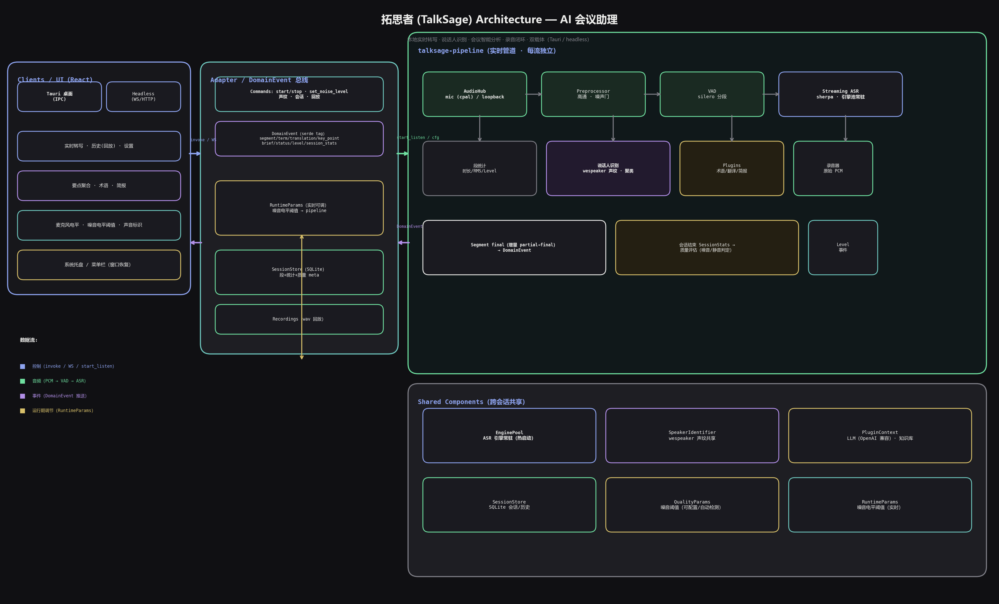

<p align="center">
  <strong>拓思者 · TalkSage</strong><br/>
  <em>Your personal AI meeting assistant — transcribe, identify speakers, analyze, and summarize.</em>
</p>

<p align="center">
  <a href="#features">Features</a> ·
  <a href="#quick-start">Quick Start</a> ·
  <a href="#usage">Usage</a> ·
  <a href="#architecture">Architecture</a> ·
  <a href="#testing">Testing</a> ·
  <a href="#documentation">Documentation</a> ·
  <a href="README_zh-CN.md">中文版</a>
</p>

> **拓思者 (Tuòsī Zhě)** — "Talk" ≈ 拓 (expand), "Sage" ≈ 思 (think): an AI assistant that expands your thinking by turning every meeting into structured knowledge.

**Platform support**: Windows (full features incl. system-loopback dual-stream capture), macOS / Linux (mic-only single stream; loopback capture is Windows-only, macOS ships the mic-permission TCC declaration).

---

## What it does

拓思者 runs **100% locally** (no cloud, no audio leaves your machine): listen to a meeting through your microphone (plus system loopback for remote callers), get **real-time bilingual transcription**, **automatic speaker identification** (register your own voice, then everyone else is separated automatically), live **term explanations**, **translation**, **key-point aggregation**, **knowledge-base briefs**, and **meeting minutes** — all while **recording the raw audio** for later regression testing.

## Features

- **Real-time streaming ASR** — Chinese (paraformer) + English (zipformer) dual streams, incremental partials, VAD segmentation; **smart punctuation** (streaming ASR emits no punctuation → heuristic 。，？ from question tails / conjunctions / subject & time words, then sentence-split display); **denoise off by default** so faint/distant speech is still recognized (enable in Settings for noisy rooms)
- **Scene modes** — one-click **Life / Meeting / Talk / Custom**: Life (sensitive VAD for short/faint speech, single stream, analysis plugins off), Meeting (dual stream + all plugins, default), Talk (dual stream + 300 ms min-commit); Custom lets you edit VAD / denoise / min-commit / engines / plugins / speaker / noise detection per-field (Settings → 场景模式)
- **Multi-speaker identification** — voiceprint registration of the owner in Settings ("我的声音"); **off by default** (online clustering can produce duplicate labels under loopback double-capture; re-enable in Scene → Custom). When enabled, every final segment is matched: owner → 「我」, others → 「客户1」「客户2」… (online clustering, labels reused)
- **Live meeting intelligence** — term/acronym explanations, real-time translation (en↔zh), rule-based key-point aggregation (questions / requirements / decisions / actions / technical, with numeric & time heuristics), knowledge-base brief retrieval; History offers **AI-extracted key points** (LLM, needs config)
- **Meeting minutes** — template-based generation via any OpenAI-compatible LLM (DeepSeek, Kimi, Ollama, …)
- **Recording & testing loop** — every listening session saves raw PCM wav per stream; `talksage trim` removes silence with the same VAD; `scripts/recording_loop.ps1` trims + replays for regression
- **Session quality assessment** — automatic noise/silence detection per session (configurable thresholds + auto background-noise calibration); noisy sessions skip downstream analysis
- **Runtime noise control** — adjust the mic noise gate live from the left panel *while listening*, no restart
- **History** — SQLite sessions with search, per-segment duration/RMS stats, quality badges
- **Two carriers** — Tauri 2 desktop app (IPC) and a headless HTTP/WS server (browser access, token-protected)
- **System tray** — Windows: minimizing hides the window into the tray (click the icon to restore); macOS: follows platform conventions with a menu-bar icon that toggles the window
- **Fixed-corpus benchmark** — `talksage bench` streams through `*.wav` corpora (engine pool warm start, model reused in-process) and reports **CER/WER accuracy + real-time factor (RTF) + first-token latency** for regression testing (borrows WhisperLiveKit's bench)
- **OpenAI-compatible transcription API** — the headless server exposes `POST /v1/audio/transcriptions` and `GET /v1/models`; existing OpenAI-ecosystem clients (whisper-style tools, curl, openai SDK) can point at this machine for **fully local transcription** (Bearer auth, json/text/verbose_json, any-sample-rate wav auto-resampled)
- **Short-segment suppression** — `audio.min_segment_ms` (min commit duration, adjustable in Settings) drops final segments shorter than the threshold, so stray "click/pop" blips in noisy sessions no longer pollute transcripts or history
- **Live conversation metrics** — real-time talk ratio (me vs them), speaking pace (WPM), question count, monologue detection, interruptions, and a **0–100 health score** (pure stats, no LLM; borrows Call.md's conversation-metrics)
- **Live coaching nudges** — rule-driven, 2-minute-cooldown hints (talk imbalance / too few questions / fast pace / confirm next steps near the end) shown as dismissible cards (borrows Call.md's nudge-engine)
- **Trio smart summary** — parallel generation of a narrative overview + **speaker-attributed key points by topic** + **action-item checklist** (History → 智能纪要; borrows Call.md's summary-generator)
- **Meeting-end webhooks** — structured session data (meeting metadata + conversation metrics + quality + notes + full transcript) pushed to n8n/Zapier/CRM when a session ends, with **SSRF protection** (private/loopback URLs rejected; configurable in Settings)
- **Structured Markdown export** — one-click single-file export (overview/metrics → notes → trio summary → transcript) from History; desktop also writes to `<data_dir>/exports/`

## Quick Start

### Prerequisites

- **Rust** (stable) with MSVC toolchain on Windows / clang on macOS / gcc on Linux
- **Node.js 18+** (frontend build)
- **Python 3** (model download script, stdlib only)
- Windows: **VS 2022 Build Tools** (C++ workload) for Tauri & sherpa-onnx linking

### 1. Get the models (~340 MB)

```bash
# via an HTTP/HTTPS proxy if your network requires one:
# export https_proxy=http://127.0.0.1:10808 http_proxy=http://127.0.0.1:10808
python scripts/download_models.py all
```

This downloads into `models/`:

| Model | Purpose |
|---|---|
| `sherpa-onnx-streaming-paraformer-zh` | Chinese streaming ASR |
| `sherpa-onnx-streaming-zipformer-en-2023-06-26` | English streaming ASR |
| `silero-vad/silero_vad.onnx` | Voice activity detection |
| `wespeaker/wespeaker_zh_cnceleb_resnet34.onnx` | Speaker embedding (voiceprint) |

### 2. Build

**Windows**

```powershell
.\scripts\talksage.ps1 env      # environment check
.\scripts\talksage.ps1 build    # cargo + frontend (debug CLI)
# desktop app (release):
cd web
npx tauri build --no-bundle
```

**macOS / Linux**

```bash
./scripts/talksage.sh build
```

See [BUILDING.md](docs/BUILDING.md) for full manual steps (static sherpa-onnx linking, proxy notes, packaging).

### 3. Run

```bash
# Desktop app (release build)
./scripts/talksage.ps1 run          # Windows

# CLI live transcription (mic)
cargo run -p talksage-cli -- listen --input mic

# CLI from a recorded wav (no GUI needed)
talksage listen --input meeting.wav

# Headless web service (browser → http://127.0.0.1:8080)
talksage serve --host 127.0.0.1 --port 8080

# Fixed-corpus benchmark (put *.wav + same-name .txt references in bench-corpus/)
talksage bench --dir bench-corpus --engine paraformer-zh

# OpenAI-compatible transcription via curl (whisper-API style; token via TALKSAGE_SERVER_TOKEN)
curl http://127.0.0.1:8080/v1/audio/transcriptions \
  -H "Authorization: Bearer $TALKSAGE_SERVER_TOKEN" \
  -F file=@meeting.wav -F model=paraformer-zh -F response_format=json
```

## Usage

| Task | How |
|---|---|
| Start listening | Left panel ▶ 开始监听 (jumps to live transcript) |
| Register your voice | Settings → 声音标识 → 录制我的声音 (6 s) |
| Tune mic level / noise gate | Left panel while listening: 麦克风电平 meter + noise-gate threshold slider (live, no restart) |
| Trim silence from a recording | `talksage trim rec.wav [-o out.wav] [--preset sensitive\|standard\|strict]` |
| Record raw audio only | `talksage record --seconds 60 [--input loopback]` |
| Import audio offline | `talksage import audio.wav` |
| Doctor / diagnostics | `talksage doctor` |
| Session analysis | `talksage session <id>` (dump raw segments: timestamps/duration/text + duplicate-segment detection to debug repeated recognition); `--dup-only` for duplicates only |
| Fixed-corpus benchmark | `talksage bench [--dir corpus] [--engine paraformer-zh\|zipformer-en] [--limit N]` (CER/WER, RTF, first-token latency) |
| Short-segment suppression | Settings → ASR → 最短提交时长 (ms, 0 = off); or `[audio] min_segment_ms` in config |

### The recording → trim → replay loop

Every listening session auto-saves raw wav per stream to `<data_dir>/recordings/`. Use them as regression material:

```powershell
.\scripts\recording_loop.ps1        # trim all recordings + replay through real ASR
.\scripts\talksage.ps1 loop
```

Details: [docs/RECORDING.md](docs/RECORDING.md)

## Architecture



A Rust workspace (single binary, no Python) with a clean domain-event bus shared by every carrier:

```
AudioHub (cpal / WASAPI loopback) → Preprocessor (denoise/highpass/noise gate)
        → VAD (silero) → streaming ASR (sherpa-onnx) → final segment
        → speaker identification (wespeaker) → plugins (term/translate/brief/keypoint)
        → DomainEvent (serde) → Tauri IPC or WS → React UI
        → session SQLite (segments + stats + quality meta)
```

| Crate | Responsibility |
|---|---|
| `talksage-core` | Domain events, session quality, text-noise scoring |
| `talksage-audio` | Mic/loopback capture, resample, denoise, wav IO, silence trim |
| `talksage-asr` | sherpa-onnx streaming engine wrapper |
| `talksage-pipeline` | VAD segmentation, dual streams, recording, runtime noise level, speaker ID |
| `talksage-plugins` | Term explainer / translator / brief retriever |
| `talksage-session` | SQLite storage + quality evaluation |
| `talksage-notes` | Minutes templates + generator |
| `talksage-server` | axum headless service (REST + WS + SPA) |
| `talksage-cli` | Launcher: listen / trim / record / import / serve / doctor / bench |
| `web/` | Tauri 2 shell + React/Vite/TS UI |

## Testing

```bash
.\scripts\run_tests.ps1        # cargo test (unit + real-model integration) + vitest
cargo test --workspace         # Rust: unit + live model tests (auto-skip if models missing)
cd web && npx vitest run       # frontend: 27 tests
```

Real-model integration tests cover: Chinese/English ASR recognition, dual-stream events, recording files, **speaker identification** (owner vs new speaker), silence trim, server API, and the **13:57 noisy-session quality case**.

## Documentation

- [architecture-v2.md](docs/architecture-v2.md) — v2 design: dual carriers, latency budget, fast/slow paths
- [BUILDING.md](docs/BUILDING.md) — build & packaging guide
- [RECORDING.md](docs/RECORDING.md) — recording / trim / regression loop
- [LOGGING.md](docs/LOGGING.md) — structured logging & debugging
- [testing.md](docs/testing.md) — automated testing strategy
- [reference-whisperlivekit.md](docs/reference-whisperlivekit.md) — reference project: WhisperLiveKit study (engine pool / benchmark / dual carriers)
- [reference-callmd.md](docs/reference-callmd.md) — reference project: Call.md study (conversation metrics / live nudges / trio summary / webhooks)

## Repository layout

```
crates/            Rust workspace (10 domain crates)
web/               Tauri 2 + React frontend
scripts/           build/run/test tooling + model downloaders
docs/              design & operation docs
models/            runtime models (gitignored, ~340 MB)
```

## License

MIT
