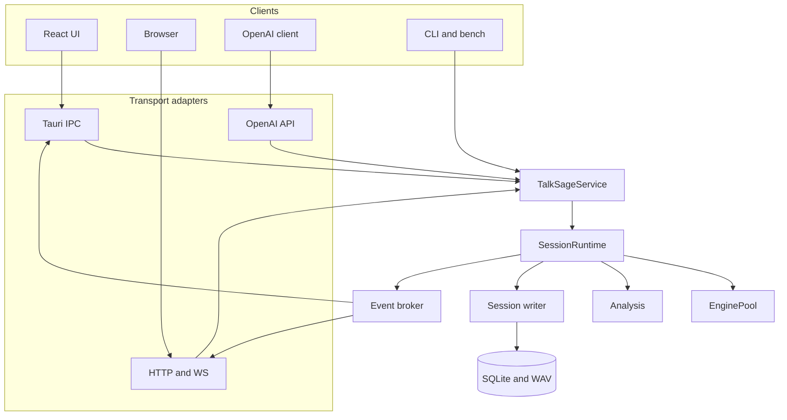
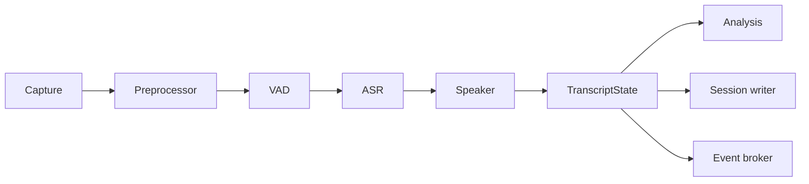

# TalkSage 架构优化方案

**日期：** 2026-08-20（修订：校正 WhisperLiveKit 归因、收束迁移范围；对齐 `develop` @ `1936be4`）
**状态：** 设计修订稿。不改变「本地优先、低延迟、桌面优先」的产品定位。
**对照：** [architecture-v2.md](architecture-v2.md)（已实施的 v2 骨架）、[reference-whisperlivekit.md](reference-whisperlivekit.md)（参考项目笔记）

---

## 1. 问题与范围

当前实现已经能在 Windows 上跑通主路径（双流转写、声纹、插件、纪要、bench、OpenAI 兼容转写 API）。下一阶段要解决的是**结构**，不是功能清单：

| # | 现状 | 后果 |
|---|---|---|
| 1 | Tauri、Server、CLI 各自装配 Pipeline / LLM / 插件 / 落库 sink | 行为已分叉：headless 客户流退回同一只麦克风；CLI `listen` 不用 `EnginePool` |
| 2 | `LivePipeline`（约千行）同时做采集、VAD、ASR、录音、声纹、指标、插件调度 | 无法单独限流、取消或对单阶段做 bench |
| 3 | 对外仍是 `is_partial: bool`，时间戳用墙上时钟 `SystemTime::now()` | UI 已按说话人分 partial 行；协议与落库仍无 committed/revision，实时 / 回放 / bench 时间轴不一致 |
| 4 | WebSocket 只广播事件，订阅时不发当前状态 | 浏览器刷新或断线丢失实时态（桌面 IPC 同进程，痛感较低） |
| 5 | 音频 `mpsc` 无界；LLM 为同步 `ureq` | CPU 跟不上实时时内存可涨；停止会话缺少统一超时 |
| 6 | 生产管道与测试管道大体共用，但入口装配不统一 | `transcribe_file` 已给 bench / OpenAI API 复用 `LivePipeline`；CLI listen 仍每次新建引擎 |

**本方案要做的：** 抽出共享应用服务，把所有入口收敛到同一个运行边界（推音频、订阅读、flush、cleanup），并把转写状态和时间轴说清楚。

**本方案不做的（现阶段）：** 把 TalkSage 做成 WhisperLiveKit 那样的多用户转写服务器；一次拆出五个新 crate；给已接入的 Whisper / Qwen3 再叠一层 AlignAtt（它们走 VAD 段结束整段识别，提交策略已经是「段级 final」）。

### 1.1 远端 `develop` 已落地（无需本方案再做）

合并自 `4daec01..1936be4`：

| 提交意图 | 对架构方案的含义 |
|---|---|
| `SegmentEngine` + 离线段级 Whisper base/small、Qwen3-ASR | 第二套后端已在。流式 `accept` 出 partial；离线 `accept` 只攒音频、`finish` 出整段。`EnginePool` 现缓存 `Box<dyn SegmentEngine>` |
| 前端按说话人持有 partial 行 | 阶段 2「累加器按 speaker 持有尾巴」已完成 |
| 跨流回声去重（麦 + 回环同一句话只留一份） | 双流产品问题，不属于应用层拆分 |
| 说话人识别默认关闭 | 在线聚类在回环双采下会刷出重复「客户 N」；识人降为可选 |
| `talksage session <id>` 转储与重复段检测 | 评测/排障入口，可与日后 SessionWriter 共存 |
| 去掉 React StrictMode + 修复 `onEvent` unlisten 竞态 | 开发态一句显示两次；属前端生命周期，不是协议问题 |

架构债未变：Tauri / Server / CLI 仍各自装配；CLI `listen` 仍 `engine_pool: None`；时间戳仍是墙上时钟。

---

## 2. 与 WhisperLiveKit 的关系

WhisperLiveKit（WLK）是**自托管实时转写服务**：客户端把音频推到服务器，服务器把转写推回来。集成边界是 `AudioProcessor.process_audio(bytes)` 入、`create_tasks()` 出 `FrontData`。[^1] TalkSage 是**本机会议助理**：壳内采集（麦克风 + Windows 回环），下游是术语 / 要点 / 纪要 / SQLite。

该抄**边界**，不该抄**体量与产品形态**。

### 2.1 吸收

| WLK 实际机制 | TalkSage 落地 | 说明 |
|---|---|---|
| `TranscriptionEngine` 模型只加载一次 | 已有 `EnginePool`（按 kind + model_dir，现为 `Box<dyn SegmentEngine>`） | 保持池化，不要退回进程强单例 |
| 每连接一个 `AudioProcessor` | `SessionRuntime` | 会话状态与引擎分离；适配器不创建管道 |
| `FrontData.lines` + `buffer_transcription` | UI 已按说话人分 hypothesis 行；Rust 侧仍缺 `TranscriptState` / revision | 插件与 SQLite 继续只消费 final；协议层再升 committed |
| 静音 / endpoint 用采样计数 | `AudioClock` | 墙上时钟只测耗时，不当事时间轴 |
| `TestHarness` 包住生产 `AudioProcessor` | 扩展现有 `offline::transcribe_file` / bench | 禁止第二套假管道；CLI listen 必须走同一装配 |
| OpenAI `/v1/audio/transcriptions` | 已落地 | 保持与生产管道共用 |
| `asr_coalesce_min_s` / 最短提交 | 已落地 `audio.min_segment_ms` | 保持 |

### 2.2 不照搬（含对原稿的校正）

| WLK 做法 | 不照搬原因 | TalkSage 方案 |
|---|---|---|
| 进程级 `TranscriptionEngine` 单例 | 无法同时热持有 paraformer + zipformer | 继续 `EnginePool`，按需加租约 / 配额 / 指标 |
| 共享 ASR 上加锁换语言 | 多会话完全串行 | 每会话租约独立引擎 |
| 约 1250 行的 `AudioProcessor` | 输入、推理、对齐、格式化集中；方案若做成第二个千行类则无意义 | 先用兼容层包住 `LivePipeline`，再按需拆 stage |
| 无界 `asyncio.Queue()` | 慢推理时内存仍可涨；仅靠约 5 秒 PCM 缓冲封顶 | **有界是我们对 WLK 的修正，不是它已有的能力** |
| 默认每次推全量 `FrontData` | 长会议带宽线性涨 | IPC 同进程可继续推事件；WS 订阅时先发当前快照 |
| 实验性 `?mode=diff` | 无序号缺口处理、无 resume、无 ring buffer；内置 UI 不用[^3] | 重连 / resync 是新设计，按新协议估工，不按「抄现成」估 |
| LocalAgreement / AlignAtt | 为「边听边改写」的非流式 Whisper 发明 | TalkSage 的 Whisper / Qwen3 已是 **VAD 切段 + 离线整段识别**（无 partial）。不要再叠 AlignAtt；`EngineKind::is_streaming()` 已足够区分两条路径 |
| 客户端上行音频 | 服务端听不见本机扬声器 | 继续壳内采集；macOS 系统音频是独立产品项 |

若将来要把 Whisper 改成真正的流式低延迟（边说边出字），再评估 AlignAtt / 稳定前缀；那是产品换路径，不是当前 `OfflineSegmentEngine` 的补丁。

---

## 3. 设计原则

1. **适配器不拥有业务。** Tauri / Axum / CLI 只做鉴权、参数解析和传输。不创建 Pipeline、插件或 LLM Provider。
2. **一个运行对象服务所有入口。** 桌面监听、headless、import、bench 都调用同一套 `start / push_audio / subscribe / flush / stop`。
3. **稳定文本与假设尾部分离。** SQLite 和插件只写 / 只读 committed；hypothesis 可闪、可丢。
4. **时间轴跟采样走。** `ts_ms` 必须能追溯到 `start_sample / sample_rate`。
5. **先兼容层，后替换内部。** 用 `SessionRuntime` 包住现有 `LivePipeline`，测试保持绿，再拆内部阶段。
6. **新 crate 后置。** 边界先以现有 crate 的 module 出现，稳定后再拆包。第一阶段不新增 `talksage-protocol` / `talksage-platform` / `talksage-testkit`。

---

## 4. 目标架构



### 4.1 应用服务

先作为 `talksage-pipeline`（或新建薄 crate）中的类型，不要第一天拆包：

```rust
pub struct TalkSageService {
    config: Arc<ConfigManager>,
    sessions: Arc<SessionStore>,
    engines: Arc<EnginePool>,
    runtimes: Arc<RuntimeRegistry>,
}

impl TalkSageService {
    pub fn start_session(&self, req: StartSession) -> Result<SessionHandle>;
    pub fn stop_session(&self, id: SessionId) -> Result<SessionResult>;
    pub fn update_config(&self, patch: ConfigPatch) -> Result<ConfigSnapshot>;
    pub fn generate_notes(&self, req: NotesRequest) -> Result<NotesResult>;
}
```

Tauri 与 Axum 的 `start_listen` / `build_llm` / `build_pipeline_config` / 落库 sink 必须收敛到这里。当前三份拷贝已经造成可见分叉（headless 客户流 `AudioInput::Mic`）。

### 4.2 SessionRuntime

桌面监听、headless、文件导入和 benchmark 的统一运行边界。第一期**包装** `LivePipeline`，不重写内部：

```rust
pub struct SessionRuntime {
    id: SessionId,
    // 第一期可由 LivePipeline 的输入源驱动；文件/bench 走 push_audio
    events: broadcast::Sender<InternalEvent>,
    cancel: CancellationToken,
}

impl SessionRuntime {
    pub fn push_audio(&self, frame: AudioFrame) -> Result<()>;
    pub fn subscribe(&self) -> broadcast::Receiver<InternalEvent>;
    pub fn flush(&self) -> Result<()>;  // 处理已接收音频
    pub fn stop(self) -> Result<SessionResult>; // 停输入 → flush → 持久化 → 归还引擎
    pub fn abort(self);                 // 不可恢复错误，取消任务
}
```

语义要求：

- `push_audio` 接收带采样位置的音频帧
- Drop 时仍停止子任务并关闭录音文件（与现有 `stop()` 等待录音收尾对齐并加强）
- 适配器不得绕过 Runtime 直接 `LivePipeline::new`

---

## 5. 实时链路（目标态）



第一期不把这些拆成六个 Tokio task。现有 `StreamWorker` 线程模型可以保留；先把**对外边界**和**committed 切分**做对。内部拆分放到阶段 3，且只在有测量（队列深度、停止超时）之后进行。

### 5.1 帧与 ASR 会话

```rust
pub struct AudioFrame {
    pub stream: StreamId,
    pub start_sample: u64,
    pub sample_rate: u32,
    pub samples: Arc<[f32]>,
}

pub trait AsrSession: Send {
    fn push_audio(&mut self, frame: &AudioFrame) -> Result<Vec<AsrUpdate>>;
    fn flush(&mut self) -> Result<Vec<AsrUpdate>>;
}
```

不要再挂一串空的 `AsrCapabilities`。当前能力面已经由 `EngineKind::is_streaming()` + `SegmentEngine` 表达：流式出 hypothesis，离线段级只在 `finish()` 出 committed。等出现第三种提交方式（例如稳定前缀 / token 时间戳）再扩 trait。

### 5.2 背压（分两步）

WLK 的队列是无界的。TalkSage 需要有界，但不要第一期就铺六条 channel。

**阶段 3 先做这一条：**

| Channel | 容量 | 满载行为 |
| --- | ---: | --- |
| capture → 处理循环 | 32 帧 | 记录 overrun；**不得阻塞**系统音频回调 |

其余（VAD→ASR、分析、落库、UI）在拆 task 时再加。在此之前，插件 LLM 已用 `std::thread::spawn`，Webhook 已有 `spawn_blocking`；补齐「同步 `ureq` 不在音频线程上跑」即可。

事件可靠性（现在就可以在 `DomainEvent` 文档里标明，实现可后置）：

```rust
pub enum DeliveryClass {
    Ephemeral,  // 电平、hypothesis：可覆盖、可丢
    Replayable, // 指标、插件增量：可从状态重建
    Durable,    // committed 转写、会话结束：必须持久化
}
```

---

## 6. 稳定文本与音频时钟

插件路径**已经**只在 `is_partial: false` 上触发，SQLite 也只写 final。要改的是模型，不是「别再让插件吃 partial」。

前端累加器**已经**按 `speaker_label` 持有各自 hypothesis 行。本轮 Rust 侧做到 **committed 段 + 每说话人 hypothesis + revision**，不必上 token 列表。

离线 Whisper / Qwen3 没有 hypothesis：VAD 段结束才 `finish()`，事件只有 final。流式 paraformer/zipformer 才需要 hypothesis 尾。同一套 `TranscriptState` 即可：离线引擎的 `hypothesis` 恒为空。

```rust
pub struct TranscriptState {
    pub revision: u64,
    pub committed: Vec<TranscriptSegment>,      // 已关闭或已确认前缀对应的段
    pub hypothesis: HashMap<SpeakerId, TranscriptSpan>, // 每流一条可覆盖尾巴
    pub processed_until_sample: u64,
    pub committed_until_sample: u64,
}

pub enum TranscriptUpdate {
    HypothesisReplaced { speaker: SpeakerId, span: TranscriptSpan },
    SegmentCommitted(TranscriptSegment),
    SegmentClosed(SegmentId),
}
```

处理原则：

- UI 同时显示 committed 与 hypothesis，后者弱化样式；双流各有独立尾巴（`TranscriptAccumulator.partialKeyBySpeaker` 已落地）
- SQLite 只保存 committed / 关闭后的 segment
- 术语、要点、知识库只消费 committed
- 智能标点不得直接改已持久化文本，应作为可追踪的后处理 revision
- 翻译继续走 committed；不要为「闪烁草稿」写库

统一时钟：

```rust
pub struct AudioClock {
    sample_rate: u32,
    accepted_samples: AtomicU64,
}
```

VAD 起止、segment 时间戳、说话人对齐、endpoint / 首字延迟、积压量都用采样位置。墙上时钟只用于「处理耗时」和「用户等待」。现有 `now_ms()` 作为段结束时刻的做法，在回放和 bench 上会与音频时间轴错位（OpenAI verbose_json 已在事后用 `ts_ms - duration_ms` 做相对化，说明问题已知）。

---

## 7. 传输：先快照，后协议 crate

内部事件与对外 DTO 分离：

```text
InternalEvent → SessionProjection → 现有 DomainEvent（过渡）→ IPC / WebSocket
```

**阶段 2 最小合同：** 客户端订阅时先收到一份当前 `SessionSnapshot`（已提交转写 + 当前 hypothesis + 指标 + 运行状态），之后仍可推现有 `DomainEvent`。桌面 IPC 同进程，此步主要修 headless 刷新丢态。

**完整 Snapshot/Delta + 序号 resync** 延后到 headless 多设备成为真实需求。WLK 的 diff 没有断线恢复；[^3] 若要做，按新协议设计，不要声称「WLK 已验证重连」。

过渡期允许继续序列化 `DomainEvent`。引入版本化 `ApiMessageV1` 时再拆 `talksage-protocol`。

---

## 8. 引擎、分析与持久化

### 8.1 EnginePool（演进，不改名优先）

现有 `EnginePool` 已按 `(kind, model_dir)` 缓存 `Box<dyn SegmentEngine>` 并 `reset` 归还（流式与离线段级同一池）。下一步是租约与指标，而不是先换成 `EngineRegistry` 这个名字：

- warmup / 健康检查（已有 `warmup`）
- 每 key 上限（已有 `POOL_MAX_PER_KEY = 4`）
- 记录命中率、加载耗时
- 以后：backend / device 进入 key（CUDA / CoreML 真正接线时）

### 8.2 分析调度

当前 `make_on_final`：骨架同步发出，`run` 另开线程。保留这个分流，补上：

- 超时与取消（尤其 LLM）
- `accepts_speculative = false`（默认）
- 会后任务（纪要、Webhook、导出）在 `stop` flush 之后跑，不占实时路径

四档 `ExecutionClass` 可以写在注释里，不必先做调度器框架。

LLM / Webhook：迁移完成前同步 `ureq` 必须走 `spawn_blocking`（Webhook 已如此）。音频线程禁止再调 HTTP。

### 8.3 SessionWriter

三份拷贝的「final 段 / 术语 / 翻译 → SQLite」应在阶段 1 收成单一写入入口。独立 writer task 可在阶段 3 加上。要求：

- committed 不因 UI 断开而丢失
- 停止顺序：关输入 → flush 管道 → 等待写入 barrier
- 录音先写临时后缀，正常关闭后原子重命名
- 启动扫描未关闭会话和临时录音，恢复或标待复核

---

## 9. 测试

继续以生产 `LivePipeline` / 未来 `SessionRuntime` 为唯一管道。`talksage bench` 已覆盖 CER/WER、RTF、首词延迟；补：

| 指标 | 含义 | 何时设门槛 |
| --- | --- | --- |
| First hypothesis / first commit | 首次文本、首次稳定提交 | 有 `AudioClock` 之后 |
| Endpoint latency | 说完到 segment close | 同上 |
| Queue depth | 采集积压 | 有界队列落地后；正常实时输入不持续增长 |
| Timing validity | 时间戳单调且可追溯到采样点 | 阶段 2 起 100% |
| CLI listen 使用 EnginePool | 与桌面同一装配 | 阶段 1 回归 |

不新建 `talksage-testkit` crate，直到 feeder / collector 在 `pipeline` 测试模块里稳定。不写 mock ASR 冒充生产管道。

---

## 10. Crate 边界

第一阶段**零个新 crate**。目标形态（边界稳定后再拆）：

```text
crates/
├── talksage-core/          # ID、领域实体、内部事件、时间模型、DeliveryClass
├── talksage-audio/         # frame、预处理、采集、WAV
├── talksage-asr/           # EnginePool、SegmentEngine（流式 + 离线段级）
├── talksage-pipeline/      # TalkSageService（先放这里）、SessionRuntime、LivePipeline
├── talksage-plugins/       # 分析插件（调度策略先留在 pipeline）
├── talksage-session/       # 写入入口、migration、查询
├── talksage-server/        # Axum adapter
├── talksage-cli/           # CLI adapter
└── web/src-tauri/          # Tauri adapter
```

以后按需再拆 `talksage-application`、`talksage-platform`、`talksage-protocol`。不要在阶段 1 把 `plugins` 改名为 `analysis`。

---

## 11. 分阶段迁移

### 阶段 1：统一应用服务（现在做）

- [ ] `TalkSageService`：配置、启停会话、插件、纪要、落库 sink 只写一次
- [ ] Tauri / Server / CLI 删除各自的 `build_llm` / `build_pipeline_config` / 事件落库 match
- [ ] CLI `listen` 使用与桌面相同的 `EnginePool`
- [ ] 修好 headless 客户流与桌面回环的契约差（至少：非 Windows 明确降级，而不是静默改用同一麦克风）
- [ ] 桌面 / HTTP 行为一致性测试（同一 `StartSession` 产生同一类配置与事件）

**完成标准：** handler 不再创建 Pipeline；相同请求在两种载体上结果一致。

### 阶段 2：Runtime 包装 + 文本 / 时钟

- [ ] `SessionRuntime` 包装现有 `LivePipeline`（兼容层，不拆线程）
- [ ] `AudioClock`；segment 时间改为采样点
- [x] 前端累加器按 speaker 持有尾巴（`267d573`）
- [ ] Rust 侧 committed / 每说话人 hypothesis / revision（协议与落库，不只是 UI）
- [ ] 订阅时发送当前快照（WS；IPC 可选）
- [ ] import / bench / listen 都经 Service + Runtime

**完成标准：** 四种入口走同一生产链路；partial 不写库、不打插件；时间戳可追溯到采样点。

### 阶段 3：背压与生命周期

- [ ] 采集队列有界 + overrun 日志（不堵回调）
- [ ] 停止路径：`CancellationToken` 或等价 join；约定时间内 flush 或明确超时
- [ ] LLM 全走 blocking pool / 日后 async；SessionWriter 可独立 task
- [ ] 过载、断流、取消测试

**完成标准：** 推理慢于实时速度时内存有界；停止会话可在时限内结束。

### 阶段 4：按需 —— 协议与多阶段拆分

仅当 headless 多设备或长会议 WS 成为真实需求：

- [ ] 版本化 DTO、Delta、序号缺口、resync
- [ ] 将 capture / VAD / ASR / writer 拆为独立 task（有测量再拆）

**完成标准：** 浏览器断网恢复不丢 committed、不出现重复行。未出现该需求前，阶段 1–3 即可发布。

### 平行产品项（不纳入本架构阶段门）

这些不依赖 crate 重划，但比阶段 4 更影响「桌面优先」：

- macOS 系统音频（ScreenCaptureKit 或明确的虚拟声卡引导 + UI 降级说明）
- GPU 后端真正接线（配置里的 `backend = auto` 目前未探测 CUDA / CoreML）
- CI 增加 macOS runner

平台差异应逐步离开 Pipeline 业务逻辑，可在阶段 2–3 顺手抽 `PlatformCapabilities` module，不必等独立 crate。

---

## 12. 架构约束（评审用）

- Transport adapter 不创建模型、插件或数据库事务
- Pipeline / Runtime 不依赖 Tauri、Axum 或 React DTO
- 内部事件不直接作为长期外部协议（过渡期 `DomainEvent` 可继续走 IPC/WS）
- 新增的实时队列必须有容量和满载策略
- 后台任务有 owner、取消路径和 join 路径
- Durable 事件先持久化或进入可靠队列，再向 UI 宣告最终完成
- 时间戳可追溯到音频采样位置
- benchmark / 集成测试必须跑生产 Runtime，不维护第二套简化管道
- 桌面、headless、CLI 与 OpenAI adapter 共享 `TalkSageService`
- 第一阶段不新增 crate；不把 AlignAtt / token 级 CommitPolicy 当作本轮完成条件（离线段级 Whisper/Qwen3 已用 VAD `finish()` 提交）

优先以兼容层包住 `LivePipeline`，建立边界和测试，再替换内部。每个阶段增加针对性契约测试，保持现有 workspace 测试通过。

---

## 13. 参考资料

[^1]: WhisperLiveKit. "Technical Integration Guide." https://github.com/QuentinFuxa/WhisperLiveKit/blob/main/docs/technical_integration.md

[^2]: WhisperLiveKit. "Ultra-low-latency self-hosted speech-to-text pipeline." https://github.com/QuentinFuxa/WhisperLiveKit — LocalAgreement / AlignAtt 是 Whisper 非流式后端的提交策略，不是 TalkSage 本轮必做项。

[^3]: WhisperLiveKit. `diff_protocol.py`。默认 `mode=full`；diff 为实验性 opt-in，无断线 resume。https://github.com/QuentinFuxa/WhisperLiveKit/blob/main/whisperlivekit/diff_protocol.py

[^4]: WhisperLiveKit. `TestHarness` / `wlk bench`：同一 `AudioProcessor` 上统计 WER、RTF。TalkSage 应对齐「生产管道即测试管道」，而不是对齐其无界队列或进程单例。
