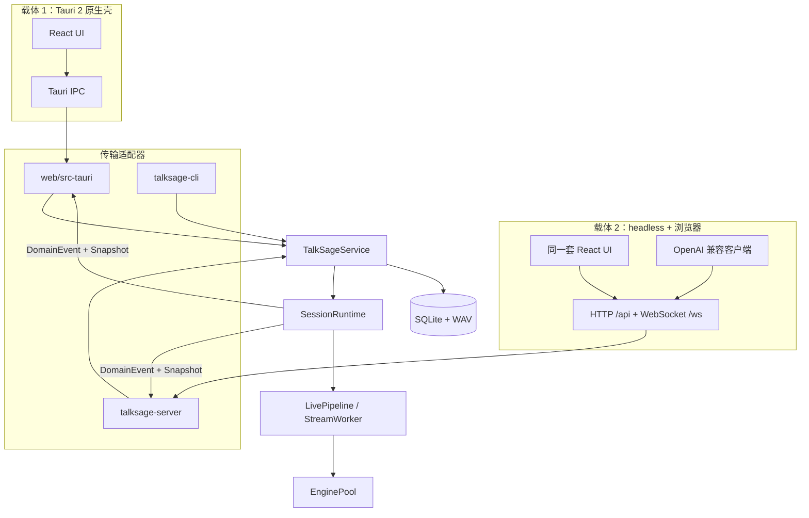
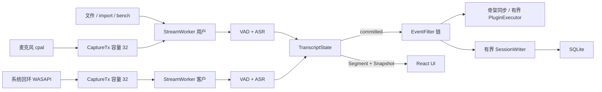

# TalkSage v2 架构设计（推翻重设计）

**日期：** 2026-08（初版）；2026-08-20 修订（共享服务 / 采样时钟 / 有界采集）
**状态：** 当前实现基线。M0–M3 主路径可用；共享服务、模块拆分、有界采集、异步持久化、插件注册表与有界插件执行器均已落地（见 §19）。版本化增量协议仍为后续产品项。
**对照：** 旧 Python/PySide6 实现（v1）已随 v2 重写从仓库移除（git 历史可查）

---

## 1. 背景与目标

TalkSage 是一款**实时个人 AI 会议助理**：在视频会议或面对面洽谈中，听对方讲话，实时提炼关键内容、术语解释、关联知识/简报，帮助用户及时回应。旧版为 Python + PySide6 桌面应用（本地双引擎 ASR + 术语插件 + 会话落库），存在以下限制，决定**推翻重设计**：

1. **固定 3 秒分块转写**，延迟高、长句被切断，无法"跟上会话速度"
2. PySide6 UI 在视频会议场景下常驻体验一般，且无翻译/说话人分离/录音回放
3. Python 生态做本地实时音频 + ASR 推理性能与分发（打包）成本高
4. 无多设备/团队使用能力

### v2 目标

- **场景不变**：实时会议个人助理（视频会议回环 + 面对面洽谈双形态）
- **低延迟**：流式 ASR，端到端"跟上会话速度"，快路径全本地
- **形态**：Tauri 2 桌面应用为主（体验最优），核心域服务化预留（未来多设备/团队）
- **技术栈**：Rust 全栈核心 + React（Web 技术栈）UI，不再使用 Python
- **结构参考**：DeepSeek Harness（DSH）的工程结构思想（CLI launcher、能力按域拆包、宿主/客户端分离、配置分层、同一 UI 多载体）

---

## 2. 需求澄清结论（2026-08 确认）

| 维度 | 结论 | 架构影响 |
|---|---|---|
| 定位 | 实时个人助理：听对方讲话 → 关键点 + 关联知识 → 支撑及时回复 | 延迟是核心指标 |
| 部署 | 先单机；**架构预留团队/多设备** | 传输层可插拔、workspace/auth 抽象 |
| 会议形态 | 视频会议（系统回环）+ 面对面（纯麦）都要 | 双路链路都要稳，回环可缺省 |
| 实时性 | 越快越好，至少跟上会话速度 | **流式 ASR 必选**，非块式 |
| 平台 | Windows + macOS | Windows 支持 WASAPI 回环；macOS 当前支持麦克风/文件，系统音频为后续项 |
| 功能 | 术语解释、简报检索、**实时翻译**、**说话人分离**、**录音回放**、**纪要模板化** | pipeline 与事件模型扩展 |
| 硬件 | CPU 独立运行；有 GPU 优先（NVIDIA CUDA + Apple Metal） | 推理后端自动探测 |
| 界面 | **Tauri 2 原生壳 + React UI**；headless 服务模式预留 | 一套 UI 两种载体 |

---

## 3. 设计原则

1. **快慢路径分离**：本地规则/检索走快路径（<300ms），LLM 走慢路径异步填充，UI 一律"先骨架后填充"
2. **领域与传输解耦**：核心域（audio/asr/pipeline/session…）为纯 Rust 库，不依赖任何传输层；IPC 与 HTTP/WS 都是可插拔适配器
3. **事件驱动**：领域事件（Segment/Term/Translation/State/Status…）定义为与传输无关的纯数据结构，IPC 与 WS 传同一结构
4. **能力按域拆包**：参考 DSH 的 `packages/dsh-*` 模式，Rust workspace 每个能力一个 crate，可独立演进与测试
5. **默认回环安全**：服务化模式下默认绑定 127.0.0.1（DSH 同款安全姿态），对外开放需显式配置 + 鉴权
6. **隐私默认本地**：音频、转写、会话默认全部本地处理与存储；录音同意保留

---

## 4. 总体架构

适配器（Tauri IPC / Axum / CLI）**不装配管道**。监听、导入、bench、OpenAI 转写都经 `TalkSageService` → `SessionRuntime` → `LivePipeline`。



**关键决策**：核心域是「库」，载体是「壳」。Tauri 模式下 IPC 直连（少一跳、回环壳内采集）；headless 模式下 HTTP/WS 暴露。两种载体和 CLI **共用同一个 `TalkSageService`**，避免各自 `build_llm` / `build_pipeline_config` / 落库。独立 `capture-agent` 进程仍是预留（当前 Windows 回环在 `talksage-audio` 同进程采集）。

---

## 5. 技术选型

| 层 | 选型 | 理由 |
|---|---|---|
| 应用壳 | **Tauri 2**（Rust） | 原生窗口控制 + 系统集成 + Web 技术栈 UI；Meetily 同场景已验证 |
| 后端语言 | **Rust**（workspace） | 音频原生、ASR 原生绑定、单二进制、并发强 |
| Web 框架 | **axum**（仅 headless 模式） | tokio 生态，WebSocket/静态托管一体 |
| ASR 运行时 | **sherpa-onnx**（k2-fsa） | C API + Rust 绑定；支持 streaming paraformer（中文）、streaming zipformer/whisper（英文）、SenseVoice（导入/重转写高质量后端）、说话人 embedding；CPU/CUDA/CoreML 多后端 |
| 前端 | **Vite + React + TypeScript** | 流式列表/虚拟化/分区表达力强，HMR 快 |
| 音频采集 | cpal + Windows WASAPI loopback | macOS ScreenCaptureKit / 虚拟声卡尚未接线 |
| VAD | sherpa-onnx 内置 VAD（或 silero-vad Rust 绑定） | 流式端点检测 |
| 存储 | **SQLite**（rusqlite/sqlx）+ Markdown 导出 | 轻量、单文件、可检索 |
| LLM | OpenAI 兼容 HTTP 客户端（DeepSeek/Kimi/Groq/Ollama…） | 与旧版一致，抽象 Provider |
| 配置 | TOML（内置默认 + 用户文件 + 环境变量） | 分层合并（简化版 DSH patch 思想） |

---

## 6. 模块划分（Rust workspace + web/）

```
talksage/
├── crates/
│   ├── talksage-cli/          # launcher：run / serve / listen / import / bench / doctor
│   ├── talksage-core/         # DomainEvent、AudioClock、TranscriptState、DeliveryClass
│   ├── talksage-audio/        # AudioHub / LoopbackCapture、有界采集队列、WAV
│   ├── talksage-asr/          # SegmentEngine（流式 + 离线段级）+ EnginePool
│   ├── talksage-pipeline/     # TalkSageService、SessionRuntime、LivePipeline、speaker
│   ├── talksage-plugins/      # term_explainer / brief_retriever / translator
│   ├── talksage-notes/        # 会后纪要 / 三段式智能纪要
│   ├── talksage-session/      # SQLite + Markdown 导出 + 录音索引 + 质量评估
│   ├── talksage-llm/          # OpenAI 兼容 Provider（complete，15s 超时）
│   ├── talksage-knowledge/    # 简报知识库检索（Jaccard，预留向量）
│   ├── talksage-config/       # 分层配置 + 场景模式
│   ├── talksage-logging/      # 文件日志
│   └── talksage-server/       # axum 适配器：REST + WS + OpenAI 转写 API
├── web/                       # React SPA
│   ├── src/lib/api.ts         # 统一 API（IPC ↔ HTTP）
│   ├── src/lib/transcript.ts  # 前端累加器（按 speaker 持有 hypothesis）
│   └── src-tauri/             # Tauri 适配器（同进程调 TalkSageService）
├── models/                    # 模型清单与下载脚本
├── docs/
└── talksage.toml              # 用户配置
```

未单独成 crate（设计预留、现阶段不拆）：`talksage-import`（CLI `import` + `StartListen::import_file`）、`talksage-tauri`（代码在 `web/src-tauri`）、`capture-agent` 独立进程。

**参考映射（旧版 → v2）**：

| 旧（Python/PySide6） | v2 |
|---|---|
| core/audio_hub.py, audio_process.py, echo_filter.py | talksage-audio |
| core/asr/*（faster-whisper/funasr/bitnet） | talksage-asr（sherpa-onnx streaming 替换） |
| core/plugin_bus.py, models.py, conversation_state.py | talksage-core + talksage-pipeline + talksage-plugins |
| core/session_store.py, session_db.py | talksage-session |
| core/knowledge_base.py, notes_generator.py, import_audio.py | talksage-knowledge / talksage-plugins(notes) / talksage-import |
| llm/openai_compat.py | talksage-llm |
| ui/*（PySide6） | web/（React） |
| main.py, config/manager.py | talksage-cli + talksage-config |

---

## 7. 核心数据流与延迟预算

### 7.1 实时链路（双流独立，不混音）

用户流（麦克风）与客户流（Windows WASAPI 回环 / 文件）**各有一条** `StreamWorker`：独立 VAD、独立 ASR、独立 `AudioClock`。不是先混音再识别。跨流同一句话由 echo-dedup 只留一份。



时间戳：`ts_ms = origin_ms + AudioClock::samples_to_ms(end_sample)`（会话墙钟原点 + 采样位置），`duration_ms` 由段采样数换算，不再用 `now_ms() - seg_start_ms`。History 回放公式 `(ts_ms - duration_ms - started_at*1000)` 仍可用。

### 7.2 延迟预算（快路径目标）

| 阶段 | 预算 |
|---|---|
| 采集 → VAD 端点判定 | ≤ 200ms |
| ASR 增量出字（流式） | ≤ 500ms（端到端） |
| 缩写检测 / 简报检索 | ≤ 50ms |
| 术语骨架上屏 | ≤ 100ms（ASR 文本到达后） |
| LLM 慢路径填充 | 秒级（异步，不阻塞快路径） |

> 参考 Meetily 的 VAD 调参经验（`audio/vad.rs`）：redemption 2s、pre-speech pad 300ms、post-speech pad 400ms、min_speech 250ms、阈值 0.50/0.35，用于平衡"连续长句不切碎"与"静音不送 ASR"。

---

## 8. 关键子系统设计

### 8.1 音频域（talksage-audio）

- **采集**：`AudioHub`（cpal 麦克风）与 `LoopbackCapture`（Windows WASAPI）；文件输入在 pipeline 里切块，不经采集回调
- **有界队列**：`CaptureTx` = `sync_channel(32)`，回调只 `try_send`；满载记 overrun、丢帧，**不阻塞**系统音频回调。收尾时 overrun>0 打 warn
- **预处理**：高通 + 块级噪声门（`Preprocessor`）；双流**不混音**，各自进 VAD
- **流式 VAD**：silero-vad（sherpa-onnx），替代旧版固定 3 秒块
- **录音器**：每流保留一份 mono WAV（原始 PCM）；停止路径等待文件头回填。会话收尾在质量评估前生成主录音：单流直接复用，双流按采样位置补齐后输出 stereo WAV（左=麦克风，右=系统音频）。历史页默认播放主录音，原始分轨折叠保留用于诊断与模型评估
- **设备/权限**：设备枚举；Windows 回环走 WASAPI；macOS 系统音频仍为产品项（ScreenCaptureKit / 虚拟声卡）

### 8.2 ASR 域（talksage-asr）

- **统一运行时**：sherpa-onnx（Rust 绑定），模型为 ONNX（`models/` 清单 + 下载脚本）
- **段级接口**：`SegmentEngine`（流式与离线同一 trait）
  - 流式 paraformer-zh / zipformer-en：`accept` 出 hypothesis，`finish` 出 committed
  - 离线 Whisper base/small、Qwen3-ASR：`accept` 只攒音频，VAD 段结束 `finish()` 整段识别（无 partial）
- **引擎池**：`EnginePool` 按 `(kind, model_dir)` 缓存 `Box<dyn SegmentEngine>`，监听会话间 `reset` 复用
- **说话人**：角色策略分为关闭、按物理通道和 WeSpeaker 声纹聚类。只有多人会议（或自定义 voiceprint）加载声纹模型。主人声纹不是聚类前置条件，只负责把匹配身份命名为“我”。段内使用 1.5s 滑动声纹窗口、500ms 步长和连续两次确认检测换人，确认后复用 `finish_speech` 安全切段。推理由每流容量 1 的后台 worker 执行，忙时跳过新窗口而不阻塞 ASR
- **GPU**：配置里有 `backend = auto`；CUDA / CoreML 真正接线仍是产品项，不是本轮架构门

### 8.3 管道与插件（talksage-pipeline / talksage-plugins）

- **入口**：`TalkSageService::start` / `finish`；内部 `SessionRuntime` 包装 `LivePipeline`（适配器不得 `LivePipeline::new`）
- **统一接缝**：`EventFilter` 处理同步纯函数过滤；`SegmentObserver` 处理 committed 段，骨架同步而慢任务进入执行器；`SessionFinalizer` 在停止、flush、写入屏障之后运行
- **内置插件（8 个）**：`short_segment`、`cross_stream_dedup`、`conversation_metrics`、`term_explainer`、`translator`、`brief_retriever`、`session_quality`、`webhook`。顺序由注册表定义，设置页由插件元数据生成
- **慢路径隔离**：单会话固定 2 个 worker、有界队列 32；满载丢弃新的慢任务，panic 隔离，15 秒后的结果丢弃。同步骨架和实时转写不受慢 LLM 拖累
- **落库**：committed 段、术语、翻译、流统计进入容量 256 的 `SessionWriter`；SQLite 串行写入。停止时通过 FIFO `Shutdown` 排空队列，再运行 finalizer
- **会后**：纪要 / 三段式智能纪要在 `talksage-notes`；质量评估与 Webhook 是 finalizer，后者默认关闭

### 8.4 会话域（talksage-session）

- SQLite schema（沿旧版扩展）：`sessions`（含录音文件路径、workspace、user）、`segments`（含 speaker_id 与可选 `speaker_attribution` JSON）、`terms`、`translations`、`key_points`、`notes`
- Markdown 导出（增量追加，不再全量重写）
- 历史检索：SQL LIKE + 可选全文索引（预留）
- 兼容迁移：启动时以幂等 `ALTER TABLE` 补齐新增列；旧 segment 没有结构化归属时，根据历史 label 推断角色并把来源标为 unknown

### 8.5 LLM 域（talksage-llm）

- `LLMProvider` trait：`complete`（OpenAI 兼容：DeepSeek/Kimi/Groq/Ollama…）
- `ureq` 请求超时 15s；插件 `run` 在固定大小执行器中运行，停止、取消或超时后丢弃迟到结果。音频回调禁止 HTTP
- token 级 `stream` 仍为预留（翻译/术语目前一次 `complete`）

### 8.6 纪要模板化（talksage-plugins/notes）

- JSON 模板定义（沿用 Meetily `summary/templates/types.rs` 的 schema：name/description/sections[title/instruction/format/item_format]）
- 内置模板：标准会议 / 谈判记录 / 技术评审 / 每日站会
- 运行时校验 + 自动生成分节 LLM 指令 + 表格化 Action Items（owner/due/转写引用/时间戳）

### 8.7 知识库（talksage-knowledge）

- 本地 `.md/.txt` 文件夹，Jaccard 关键词检索（沿用旧版，零依赖）
- 预留向量化升级（本地 embedding 模型或 OpenAI 兼容 embeddings 接口）

---

## 9. 事件协议（与传输无关）

所有领域事件为纯数据（serde 序列化），IPC 与 WS 传同一结构。`DomainEvent::delivery_class()` 标明可靠性；durable 事件由独立 writer 持久化：

| DeliveryClass | 含义 | 典型事件 |
|---|---|---|
| Ephemeral | 可覆盖、可丢 | `Level`、hypothesis（`Segment { is_partial: true }`） |
| Replayable | 可从快照重建 | `Snapshot`、`Status`、`Metrics`、插件骨架 |
| Durable | 必须持久化 | committed `Segment`、`SessionStats`、插件 Final |

```rust
enum DomainEvent {
    Segment {
        speaker_id: u32, speaker_label: String, text: String,
        is_partial: bool, ts_ms: u64, duration_ms: u64, rms: f32,
        revision: u64, start_sample: u64, end_sample: u64,
    },
    Snapshot { /* committed + 每说话人 hypothesis + revision + stage */ },
    Term { result_id, status: Skeleton|Final, content },
    Translation { … },
    KeyPoint { … },
    Brief { … },
    State { … },
    Status { stage, message },
    Level { mic_rms, loopback_rms },
    SessionStats { … },
    Metrics { … },
    Nudge { … },
}
```

- **committed vs hypothesis**：插件与 SQLite 只消费 `is_partial: false`。Rust `TranscriptState` 与前端 `transcript.ts` 都按 speaker 持有一条可覆盖尾巴。
- **订阅快照**：headless WS 在订阅前先发当前 `DomainEvent::Snapshot`，避免刷新丢实时态。
- 前端：`subscribe(handler)`（IPC 事件 / WS 消息适配器统一）。

---

## 10. 前端设计（web/）

- **分区**：上下文 / 实时转写（说话人着色、增量渲染） / 术语卡片 / 翻译区 / 要点区 / 简报区；虚拟化长转写（参考 Meetily `VirtualizedTranscriptView`）
- **统一 API 抽象**：`lib/api.ts` 定义 `AudioCapture` / `SessionApi` / `HistoryApi` / `SettingsApi` 接口，IPC 与 HTTP 两套实现
- **音频**：Tauri 模式音频全在壳内（前端只收事件 + 控制命令）；headless 模式当前同样由服务端采集（浏览器 `getUserMedia` 上行仍为预留）
- **转写累加器**：`lib/transcript.ts` 按 `speaker_label` 持有 hypothesis；收到 `snapshot` 时 `reset` + `applySnapshot` 重建行
- **状态管理**：轻量 context + reducer（参考 Meetily `SidebarProvider` 模式，无需重型框架）
- **录音回放**：Web Audio 播放（音频文件经宿主提供）

---

## 11. 多设备 / 团队预留（先不做，留接口）

| 能力 | MVP（Tauri） | 预留接口 |
|---|---|---|
| 传输层 | IPC | `Transport` trait（IPC / HTTP+WS 双实现） |
| 鉴权 | 无（本地 IPC） | `AuthProvider` trait（headless 模式启用：token / 账号） |
| 会话归属 | 默认 workspace/user | `sessions.workspace_id` / `user_id` 字段 |
| 数据目录 | `~/.talksage/` | `~/.talksage/{workspace}/…` 结构 |
| 服务暴露 | 不启用 | `talksage serve --host 0.0.0.0 --token …`（默认 127.0.0.1） |

---

## 12. 平台层（Windows / macOS）

| 能力 | Windows | macOS |
|---|---|---|
| 回环采集 | WASAPI loopback（壳内 / capture-agent） | ScreenCaptureKit（macOS 13+）或 BlackHole 虚拟声卡 |
| 权限 | 麦克风；无需额外（回环走 WASAPI） | 麦克风 + 屏幕录制（SCK 必需）权限引导 |
| GPU | NVIDIA CUDA（ONNX Runtime CUDA） | Apple Metal / CoreML |
| 分发 | NSIS 安装包（WebView2 常驻） | dmg（WKWebView） |

---

## 13. 配置管理（talksage-config）

分层合并（简化版 DSH patch 思想）：**内置默认 → 用户 `talksage.toml` → 环境变量 → CLI 参数**。配置域：

```toml
[asr]
client_engine = "zipformer-en"        # 或 whisper
user_engine = "paraformer-zh"
backend = "auto"                      # auto | cpu | cuda | metal

[audio]
mic_device = null
loopback_device = null                # 视频会议回环
ducking = { enabled = true, threshold = 0.04, factor = 0.35 }
vad = { redemption_ms = 2000, pre_pad_ms = 300, post_pad_ms = 400, min_speech_ms = 250 }

[llm]
default = "deepseek"
providers = { deepseek = { base_url = "…", model = "…", api_key = "" } }

[plugins]
term_explainer = { enabled = true, cooldown_seconds = 10 }
translator = { enabled = true }
brief_retriever = { enabled = true }
notes = { template = "standard_meeting" }

[session]
sqlite = true
export_markdown = true
record_audio = true                    # 录音回放依赖

[privacy]
recording_consent_accepted = false

[server]                              # headless 模式（预留）
enabled = false
host = "127.0.0.1"
port = 8080
token = ""
```

---

## 14. 安全与隐私

- 音频、转写、会话**默认全本地**，不上传（同旧版承诺）
- 录音同意弹窗（`privacy.recording_consent_accepted` 持久化）
- headless 模式默认 127.0.0.1；对外开放需显式配置 + token（DSH 同款姿态：无 TLS/无鉴权的 v1 仅限回环）
- API Key 仅存本地配置

---

## 15. 里程碑

| 阶段 | 内容 | 交付 |
|---|---|---|
| **M0 骨架** | Rust workspace + launcher + Tauri 壳 + React 空壳 + IPC hello-world + 配置加载 | 可启动空应用 |
| **M1 实时转写** | 采集（麦+回环）→ 流式 VAD → streaming 双引擎 → 增量上屏（说话人双流着色） | 核心价值闭环 |
| **M2 会议辅助** | 术语/简报/要点/上下文 + 翻译插件 + SQLite 会话 + 历史页 | 旧版功能等价 + 翻译 |
| **M3 产品化** | 录音回放、重转写、纪要模板化、设置页/向导、双平台打包 | 可日常使用 |
| **M4（预留）** | 多设备鉴权、版本化 Delta/resync、macOS 系统音频 | 浏览器断网恢复不丢 committed；不阻塞当前单机版本发布 |

---

## 16. 风险与开放问题

| 风险 | 缓解 |
|---|---|
| streaming 模型中文准确率 vs 离线 paraformer | 双引擎可切换；导入/重转写用 SenseVoice/离线模型补高质量 |
| macOS ScreenCaptureKit 权限与稳定性 | 提供 BlackHole 虚拟声卡降级路径（Meetily 同款） |
| 说话人分离在实时场景精度有限 | 分层策略：双流隐式为主，embedding 聚类增强，离线完整 diarization |
| Tauri 2 + WebView2/WKWebView 兼容 | 前端避免实验性 API；提供 headless 浏览器访问作为降级载体 |
| LLM 延迟拖慢实时体验 | 快慢路径分离；翻译/术语用低延迟 provider（Groq/Ollama） |
| 模型体积与分发 | models/ 清单 + 首次运行下载（同旧版模式）；GPU 升档可选 |

---

## 17. 参考项目与借鉴点

| 项目 | 借鉴点 |
|---|---|
| [DeepSeek Harness（DSH）](https://github.com/deepseek-ai/DeepSeek-Harness) | CLI launcher + profile；能力按域拆包；宿主默认回环安全；/api + WS 事件；配置分层；同一 UI 跑浏览器或原生壳走 IPC |
| [Meetily](https://github.com/Zackriya-Solutions/meetily) | Tauri 2 同场景验证；流式 VAD 调参；环形缓冲混音；True-Peak 限幅/EBU R128；增量 checkpoint 保存；纪要模板系统；WAL 恢复；whisper 调参 |
| [sherpa-onnx](https://github.com/k2-fsa/sherpa-onnx) | 统一 ASR 运行时：streaming paraformer/zipformer、SenseVoice、说话人 embedding；Rust 绑定；CUDA/CoreML 多后端 |

## 18. 架构演进 v2.1：为扩展而重构（参考 WhisperLiveKit）

新功能（说话人识别/质量评估/录音闭环/运行期调节/托盘/多选历史）使管线职责增多，
参考 WhisperLiveKit 的"引擎单例 + 会话/计算解耦"思想完成以下演进：

### 18.1 ASR 引擎池（EnginePool）—— 引擎常驻、监听热启动
- `talksage-asr::EnginePool`：按 `(kind, model_dir)` 缓存 `Box<dyn SegmentEngine>`，跨监听会话复用；归还时 `reset`。模型只加载一次，第二次监听毫秒级就绪。
- 桌面 / headless / CLI listen 共用 `TalkSageService` 持有的池。
- 详见 `crates/talksage-asr/src/lib.rs` 的 `pool_tests`（acquire/release/warmup）。

### 18.2 RuntimeParams —— 运行期参数集中
- RuntimeParams { noise_level: Arc<AtomicU32> } 取代散落的运行期字段；
  新增"监听中可调"参数（VAD 灵敏度、降噪强度等）只需在此扩展，
  无需再改 LivePipelineConfig 与所有构造点。

### 18.3 分层职责（共享组件独立）
| 组件 | 归属 | 说明 |
|---|---|---|
| TalkSageService | talksage-pipeline | 配置 / 启停 / 插件 / 落库（适配器共用） |
| SessionRuntime | talksage-pipeline | 包装 LivePipeline；TranscriptState + 快照 |
| EnginePool | talksage-asr | 引擎常驻（共享） |
| SpeakerIdentifier | talksage-pipeline::speaker | wespeaker 声纹 + 在线聚类（共享） |
| PluginContext | talksage-plugins | LLM + 知识库（共享） |
| SessionStore | talksage-session | SQLite 会话/历史/质量 meta |
| QualityParams | talksage-session | 噪音阈值（可配置/自动检测） |
| RuntimeParams | talksage-pipeline | 运行期可调（每会话） |

### 18.4 架构图
- 结构图以本文 §4 / §7.1 / §19 的 Mermaid 为准（可 diff）。
- 位图：`python scripts/generate_architecture.py` → `docs/architecture.png`（风格仿 WhisperLiveKit）。

### 18.5 后续扩展位
- ~~固定语料转写评测（WER/RTF/延迟）~~ ✅ `talksage bench`（EnginePool 热启动 + core::cer/wer）
- ~~最小提交时长 / ASR 合并参数~~ ✅ `audio.min_segment_ms`（见 §18.7）
- ~~入口统一 / 采样时钟 / 有界采集~~ ✅ 2026-08-20 阶段 1–3（见 §19）
- ~~统一插件注册表 / 配置元数据~~ ✅ 2026-08-20 阶段 1–5
- ~~独立 SessionWriter / 有界插件执行器 / Pipeline 模块拆分~~ ✅ 2026-08-21（见 §19）
- ~~结构化说话人归属 / SQLite 兼容迁移~~ ✅ 2026-08-21（见 §19.7）
- headless 多会话：ServerState 从单管道 → 会话表（每会话一个 Runtime，共享 EnginePool）
- 免注册说话人分离（sherpa diarization）：与现声纹方案互补
- 版本化 DTO / Delta / 序号 resync：仅当长会议 WS 或浏览器断网恢复成为真实需求

### 18.6 OpenAI 兼容转写 API（headless，对接既有生态）
- 路由：`GET /v1/models`（列出 paraformer-zh / zipformer-en）、`POST /v1/audio/transcriptions`
- 输入：multipart（`file`=PCM wav 任意采样率自动重采样 16k；`model`；`response_format`=json|text|verbose_json；`language` 暂忽略）
- 鉴权：`Authorization: Bearer <token>` 或 `X-Talksage-Token`（`TALKSAGE_SERVER_TOKEN` 启用）
- 实现：与 `talksage bench` 共用 `talksage_pipeline::offline::transcribe_file` → `SessionRuntime`（引擎池热启动，同一套 VAD+ASR），转写在 blocking 线程池执行
- verbose_json 输出段级时间轴（相对音频起点）、RTF、首词延迟
- 测试：server_api.rs（真实 wav multipart → 文本；非法音频 400；缺 file 400；无鉴权 401）

### 18.7 最小提交时长（噪音短段抑制）
- 配置：`[audio] min_segment_ms = 400`（ms；0/缺省 = 不限制），桌面设置页「音频处理 → 最短提交时长」可调
- 管道：`LivePipelineConfig.min_commit_ms` → `StreamWorker`，`finish_speech` 中 final 段时长 < 阈值时**丢弃**（不 emit、不计数、不触发插件），日志打 `短段丢弃`
- 动机：噪音会话中偶发的"哒/咔"短段会污染转写与历史；400~800ms 阈值可在不丢正常语句的前提下滤掉
- 覆盖：桌面 / headless / CLI listen / import 均经 `TalkSageService` 读场景与 `min_commit_ms`；
  `talksage bench` / OpenAI 转写 API（`offline::transcribe_file`）固定 `min_commit_ms=0`（评测/API 保持原始输出）
- 测试：pipeline_live.rs `min_commit_ms_suppresses_short_segments`（60s 阈值 → 0 final；0 阈值 → 有 final）；config `user_file_overrides_defaults` 校验 toml 读取

### 18.8 会中会话指标 + 实时提示 + 三段式纪要（借鉴 Call.md）
- **会话指标（纯统计无 LLM）**：`talksage-core::metrics`（`compute_conversation_metrics`）——我/客户发言占比、语速 WPM（clamp 50–250）、提问数（中英文问句启发式）、独白检测（连续 >45s）、打断计数（异说话人段重叠）、平均段长、健康分 0–100
- **会中推送**：pipeline `run_loop` 包装事件流——final 段聚合进共享 seg_log，随之推送 `DomainEvent::Metrics`；`SessionStats` 增加 words/questions（入历史 meta 的 `StreamMeta`）
- **实时提示**：`core::NudgeEngine`（规则 + 2min 冷却 + 优先级 talk_ratio→questions→pace→next_steps + 中文模板），触发推送 `DomainEvent::Nudge`，前端浮动 toast 可关闭
- **三段式纪要**：`notes::TrioGenerator` 三个专精 prompt **并行**（叙事概述 / 归属发言人的主题要点 JSON / 行动项清单 JSON，容错提取 JSON），入口：Tauri `generate_trio_notes` + server `POST /api/session/{id}/trio-notes`，存 `sessions.trio` 列，历史页"智能纪要"展示
- 测试：core metrics 5 项单测（占比/独白/打断/健康分/问句启发式/冷却限流）；pipeline_live 集成断言 Metrics 事件；notes trio mock 测试；session trio 存取测试

### 18.9 会议结束 Webhook + Markdown 导出（借鉴 Call.md）
- **Webhook（SSRF 防护）**：`talksage-core::webhook`——`validate_webhook_url`（仅 http/https；拒绝回环/私网/链路本地 IP、localhost、`.local`、解析到私网的主机名；解析失败放行避免离线误伤）+ `post_webhook`（ureq 直连、禁环境代理、10s 超时）+ `trigger_webhooks`（逐条结果）
- 配置：`[webhooks] enabled + urls`（设置页「Webhook」tab，每行一个 URL）；会话结束时（`TalkSageService::finish` 后台线程）构建 payload 推送
- **Markdown 导出**：`talksage_session::export_markdown` 单文件（概览/指标 → 会议纪要 → 智能纪要 → 转写）；入口 Tauri `export_session_markdown`（写入 `<data_dir>/exports/session-{id}.md`）+ server `GET /api/session/{id}/export`；历史页「导出 Markdown」按钮（blob 下载 + 桌面端显示落盘路径）
- 测试：core webhook 4 项（URL 校验含云元数据端点拒绝 + 本地 TcpListener 端到端 POST）；session payload/export 单测；server export API 集成测试

### 18.10 场景模式（听写 / 会话 / 双语 / 会议 / 课堂 / 自定义）
- 配置：`[scene] mode = "dictation"|"conversation"|"translation"|"meeting"|"lecture"|"custom"` + `[scene.custom]` 全量参数
- `SceneParams`：VAD/降噪/最短段、两条流的 ASR 引擎与语言、翻译策略、分析插件 allowlist，以及显式角色策略 `off / channel / voiceprint`。只有 `voiceprint` 加载 WeSpeaker；`channel` 直接使用麦克风/系统音频的来源角色。
- 内置模板：单人听写（灵敏 VAD、单流、最低资源）、一对一会话（默认、同语言双流、按通道角色）、双语对话（中文用户流 + 英文对方流、双向翻译）、多人会议（在线声纹聚类）、演讲/课堂（长段单流、术语与简报）和自定义。场景是完整运行预设，pipeline 不再从 speaker id 猜测语言或用全局 ASR 设置暗中覆盖场景模型。
- 应用：`TalkSageService` 构建管道时取 `snapshot.scene.effective()` → VAD/降噪 + 每流引擎和语言 + 翻译策略 + 插件 + 角色模式 + `min_commit_ms`；质量评估 auto_detect 跟随场景
- 前端：设置页「场景模式」tab（4 模式按钮 + 非自定义只读摘要 + 自定义全量编辑），保存 `scene.{mode,custom}`
- 测试：锁定六种预设的输入流、语言、翻译、插件和角色策略，并覆盖 TOML roundtrip、自定义参数持久化及翻译方向。

---

## 19. 当前架构基线（2026-08-21）：共享服务、可控并发与持久化屏障

优化阶段均已落地，未新增 crate；`LivePipeline` 保留为实时内核，由 `SessionRuntime` 和 `TalkSageService` 包装。Whisper / Qwen3 继续走 VAD 切段 + `finish()`，不叠 AlignAtt。

### 19.1 为何改

| 问题 | 后果 |
|---|---|
| Tauri / Server / CLI 各自装配 Pipeline、LLM、落库 | headless 客户流曾静默改用麦克风；CLI `listen` 不用 `EnginePool` |
| 段时间戳用 `SystemTime::now()` | 实时 / 回放 / bench 时间轴不一致 |
| 采集 `mpsc` 无界；`stop()` 无界 `join` | ASR 慢于实时时内存可涨；停止可卡死 UI |

### 19.2 入口：TalkSageService

`talksage-pipeline::TalkSageService` 持有 `ConfigManager`、可选 `SessionStore`、`EnginePool`。适配器只做传输。

| 入口 | 路径 |
|---|---|
| 桌面 / headless 监听 | `StartListen::desktop()` → `service.start` → `SessionRuntime` |
| CLI `listen` | 同上（共用引擎池）；`--client` 才开双流，否则 `ClientCapture::Off` |
| CLI `import` | `StartListen::import_file` → Service（不再自建 Pipeline） |
| bench / OpenAI `/v1/audio/transcriptions` | `offline::transcribe_file` → `SessionRuntime` |

`ClientCapture::Auto`：场景允许客户流且 Windows → 回环；非 Windows **明确降级为单流并记日志**，不改用麦克风。

### 19.3 SessionRuntime 与 TranscriptState

`SessionRuntime` 包装 `LivePipeline`：拦截 `Segment` → `TranscriptState::apply` → 盖 `revision`。`snapshot()` 供 WS 订阅时先发当前态。适配器不得 `LivePipeline::new`。

```text
committed: Vec<TranscriptSegment>     // SQLite / 插件只读这个
hypothesis: HashMap<speaker_id, span> // 每流一条可覆盖尾巴；离线引擎恒空
revision / processed_until_sample / committed_until_sample
```

### 19.4 采样时钟

每条 `StreamWorker` 一个 `AudioClock`。`ts_ms = origin_ms + samples_to_ms(end_sample)`，`duration_ms` 由段采样数换算。墙上时钟只测耗时。

### 19.5 有界采集与公平调度

`CaptureTx`：`sync_channel(32)` + `try_send`。满载 overrun（第 1 次及每 32 次打日志）并丢帧，**不阻塞** cpal / WASAPI 回调。Pipeline 用非阻塞轮询与 round-robin 改变首选流，避免固定偏向 user；文件输入由 deadline pacer 驱动，暂停恢复后不会追赶积压时钟。

### 19.6 停止、慢插件与持久化

- `stop_with_timeout` 默认 5s：`AtomicBool` 取消 + 旁路 `join`；超时 warn 并返回 `false`，不卡 UI。ASR `finish()` 不可中断，超时是安全网。
- 插件骨架同步、本地、无 HTTP；慢 `run` 进入每会话 2-worker / 32-job 的有界执行器。队列溢出、panic、取消和迟到结果均隔离，不阻塞音频线程。
- `SessionWriter` 用容量 256 的 FIFO 队列和独立 SQLite 线程持久化 durable 事件。正常结束先 drain writer，再执行只读 finalizer，保证质量评估和 Webhook 能看到完整会话。
- `LivePipeline` 已拆出 endpoint、segment lifecycle、input scheduler、statistics、speaker assignment、plugin executor 等模块；`lib.rs` 只保留编排与公共类型。

### 19.7 说话人归属与兼容数据

- `SpeakerAttribution` 将音频来源、角色、身份和置信度结构化，避免业务继续解析“我/客户 N”等展示文本。
- 过滤器之后才提交 speaker assignment，防止被短段过滤或跨流去重吞掉的段污染声纹状态。
- 未确认身份使用有界多候选集合，而不是单个候选槽；A/B 交替发言不会互相覆盖，任一候选再次出现即可稳定为“客户 N”。
- 单个低相似度声纹窗口不会立即换人；连续两个窗口偏离稳定锚点且当前轮次至少 2s 才主动切段。检查节拍不会在设备卡顿恢复后追赶历史窗口。
- 声纹窗口推理不在 Pipeline 主线程执行；任务队列容量为 1，结果携带 segment generation，旧段迟到结果不会切断新段。底层 WeSpeaker extractor 由互斥锁保护并发安全。
- 会后精修使用 sherpa-onnx `OfflineSpeakerDiarization`（pyannote segmentation + WeSpeaker embedding + fast clustering）生成完整时间轴；转写段只在某 speaker 覆盖至少一半时才接受校正。CLI `talksage diarize` 已可独立评估，自动回写历史会话仍是下一接入点。
- SQLite 的 `speaker_attribution` 为可选 JSON；旧数据库自动补列，旧行读取时降级推断并标记未知来源。

### 19.8 明确不做（现阶段）

- 把 TalkSage 做成多用户 STT 服务器；拆 `talksage-protocol` / 六个 Tokio task
- AlignAtt / token 级 CommitPolicy
- 把 VAD、ASR、UI 每一步都拆成独立 task；当前拆分以真实背压边界为准
- 版本化 Delta + 序号 resync（阶段 4，按需）
